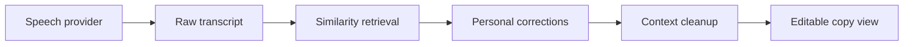

# Adaptive Speech-to-Text Assistant

An accessibility-focused transcription prototype that learns a user's recurring speech-to-text corrections while preserving the intended meaning and keeping the final text easy to copy.

This repository is a public portfolio reconstruction of a prototype originally developed in 2025 and iterated with two users who have Parkinson's. It contains no recordings, transcripts, names, or health information from those sessions. All examples are synthetic.

## Why this exists

General-purpose speech recognition can repeatedly mishear the same person's words, names, or phrases. This project adds a personalized correction layer after transcription:

1. Receive raw text from a speech-to-text provider adapter.
2. Retrieve similar previous corrections from the user's local correction memory.
3. Apply only high-confidence replacements.
4. Run lightweight contextual cleanup without changing the speaker's meaning.
5. Return an editable result designed for one-click copying.



## Features

- TF-IDF cosine similarity over personalized correction examples
- Conservative confidence threshold and an audit trail for every applied change
- Contextual punctuation and sentence cleanup with no external LLM required
- Pluggable provider interface for a real speech-to-text API
- FastAPI endpoints and an accessible React + TypeScript interface
- Keyboard-friendly editing and copy workflow
- Unit tests for retrieval, correction, confidence, and intent preservation

## Quick start

Backend:

```bash
cd backend
python -m venv .venv
source .venv/bin/activate
pip install -e .
uvicorn app.api:app --reload
```

Frontend:

```bash
cd frontend
npm install
npm run dev
```

Then open `http://localhost:5173`.

## API

`POST /assist`

```json
{
  "raw_transcript": "please email doctor patel about the park in sons appointment"
}
```

Response:

```json
{
  "corrected_transcript": "Please email Dr. Patel about the Parkinson's appointment.",
  "changes": [
    {
      "source": "doctor patel",
      "replacement": "Dr. Patel",
      "confidence": 1.0
    },
    {
      "source": "park in sons",
      "replacement": "Parkinson's",
      "confidence": 1.0
    }
  ]
}
```

## Privacy and safety

- The demo operates on text and stores correction examples in memory only.
- A production deployment should encrypt correction memory, support deletion/export, and avoid retaining audio by default.
- The system assists transcription; it does not diagnose, interpret medical symptoms, or replace professional accessibility services.
- Low-confidence matches are left unchanged so the user remains in control.

## Public reconstruction note

The original prototype used an existing speech-to-text service and a personalized correction workflow. This edition recreates the shareable software design using generated examples and a provider-neutral adapter.

## License

MIT
